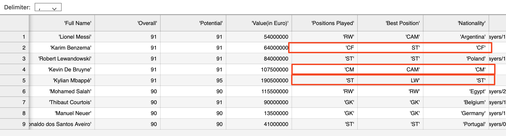
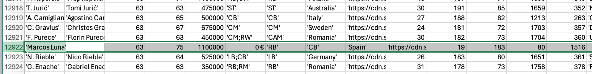
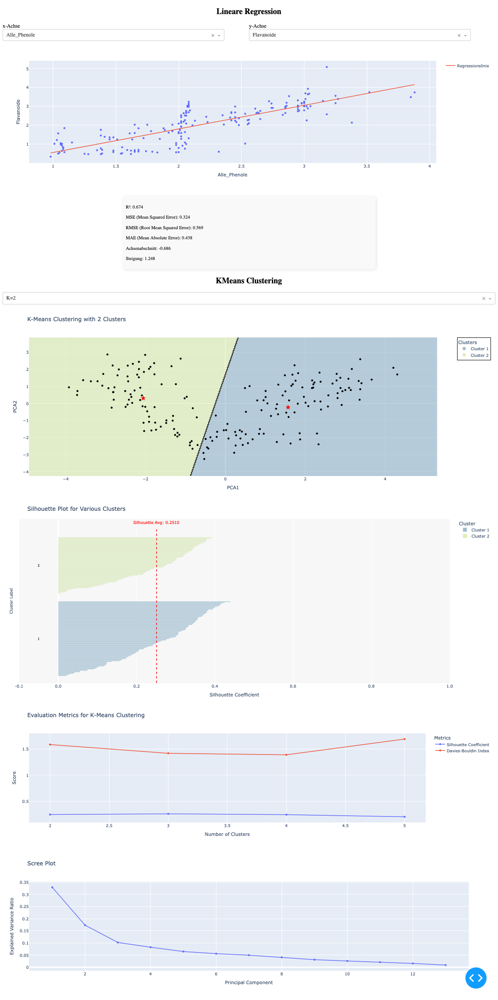
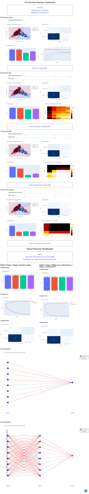

# ML Data Visualization Suite

Interactive machine learning visualization dashboards built with **Plotly Dash** and **scikit-learn**.

## Overview

A comprehensive collection of 4 interactive machine learning visualization applications developed for the **"Interactive Data Visualization Analysis"** course at University Leipzig, Germany. Each project demonstrates different ML algorithms through real-time interactive dashboards with parameter adjustment capabilities.

## Technology Stack

- **Visualization**: Plotly Dash - Interactive web applications
- **Machine Learning**: scikit-learn - ML algorithms and evaluation  
  - Linear Regression
  - K-Means Clustering
  - Logistic Regression
  - Decision Tree
  - K-Nearest Neighbors
  - Neural Network
- **Data Processing**: pandas & NumPy - Data manipulation and analysis
  - PCA
- **Evaluation Techniques**
  - Silhouette analysis, Davies-Bouldin index
  - 10-Fold Cross-Validation
  - Bootstrap 0.632 Method
  - Comprehensive Metrics
- **Additional**: matplotlib, regex for enhanced functionality

## Project Portfolio

### 1. 🏈 Football Data Interactive Dashboard

**Objective**: Interactive exploration and visualization of football dataset with real-time filtering capabilities.

**Key Features**:
- Multi-perspective data analysis with dynamic filtering
- Interactive chart generation with multiple visualization types
- Real-time parameter adjustment for data exploration

*Interactive football statistics dashboard with filtering options*

*Advanced football data analysis with multiple chart perspectives*

---

### 2. 🍷 Wine Quality Analysis: Regression & Clustering

**Objective**: Comprehensive wine quality analysis combining linear regression and K-Means clustering with interactive visualizations.

**Machine Learning Techniques**:
- **Linear Regression**: Interactive R² calculation for all feature combinations
- **K-Means Clustering**: Dynamic clustering analysis (2-5 clusters)  
- **Principal Component Analysis**: Dimensionality reduction for visualization
- **Evaluation Metrics**: Silhouette analysis, Davies-Bouldin index

**Interactive Features**:
- Real-time regression analysis with adjustable X/Y variables
- Dynamic clustering visualization with decision boundaries
- PCA scree plots showing explained variance ratios
- Comprehensive statistical metrics display (R², MSE, RMSE, MAE)

*Interactive regression and clustering analysis with real-time parameter adjustment*

---

### 3. 🚢 Titanic Survival Prediction: Cross-validation & Bootstrapping

**Objective**: Advanced model evaluation using cross-validation and bootstrap methods on the famous Titanic dataset.

**Machine Learning Models**:
- **Logistic Regression**: Linear classification with probability estimates
- **Decision Tree**: Rule-based classification with visual tree structures  
- **K-Nearest Neighbors (k=3)**: Instance-based learning algorithm

**Advanced Evaluation Techniques**:
- **10-Fold Cross-Validation**: Robust performance estimation
- **Bootstrap 0.632 Method**: Alternative evaluation with 100 iterations
- **Comprehensive Metrics**: Accuracy, Precision, Recall, F1-score analysis
- **Visual Comparisons**: Side-by-side confusion matrices and metric charts

**Data Engineering**:
- Feature engineering with age imputation and categorical encoding
- One-hot encoding for categorical variables
- Systematic missing value handling

---

### 4. ⭐ Pulsar Star Classification: SVM & Neural Networks

**Objective**: Advanced classification of pulsar stars using Support Vector Machines and Artificial Neural Networks with comprehensive hyperparameter optimization.

**Support Vector Machine Implementation**:
- **Four Kernel Types**: Linear, Polynomial, RBF, Sigmoid kernels
- **Interactive Parameter Tuning**: C parameter (0.01-100), Gamma, Degree parameters
- **Real-time Visualizations**: Decision boundary plots with PCA projection

**Neural Network Architecture**:
- **Model 1**: Simple perceptron (8 inputs → 1 output, logistic activation)
- **Model 2**: Multi-layer network (8 → 8 → 1, ReLU activation)
- **Advanced Features**: Interactive topology diagrams, learning curves, weight visualization

**Performance Achievements**:
- **Best SVM Results**: 98.08% accuracy (Polynomial & RBF kernels)
- **Neural Network Results**: 98.08% accuracy (simple perceptron)
- **Technical Implementation**: Grid search optimization, model persistence

*SVM decision boundaries and neural network topology visualization with performance metrics*

## Key Technical Achievements

- ✅ **Real-time Interactivity**: All applications feature dynamic parameter adjustment
- ✅ **Multiple ML Paradigms**: Classification, regression, clustering, and evaluation techniques  
- ✅ **High Performance**: Achieved 98%+ accuracy on challenging datasets
- ✅ **Comprehensive Evaluation**: Cross-validation, bootstrap methods, multiple metrics
- ✅ **Professional Visualization**: Publication-quality interactive dashboards

## Academic Context

Developed as the practical component for **Computer Science Bachelor studies** at **University Leipzig, Germany**. This coursework demonstrates advanced competencies in:

- **Interactive Data Visualization** using modern web frameworks
- **Machine Learning Implementation** with industry-standard libraries
- **Statistical Analysis** with proper evaluation methodologies  
- **Software Engineering** with modular, documented code architecture