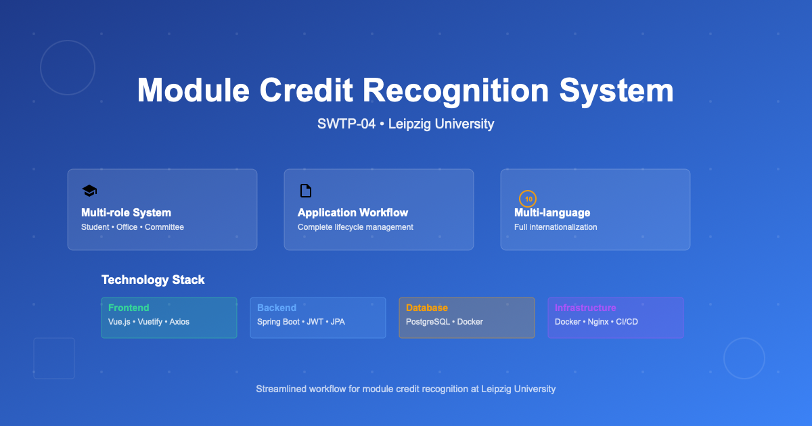
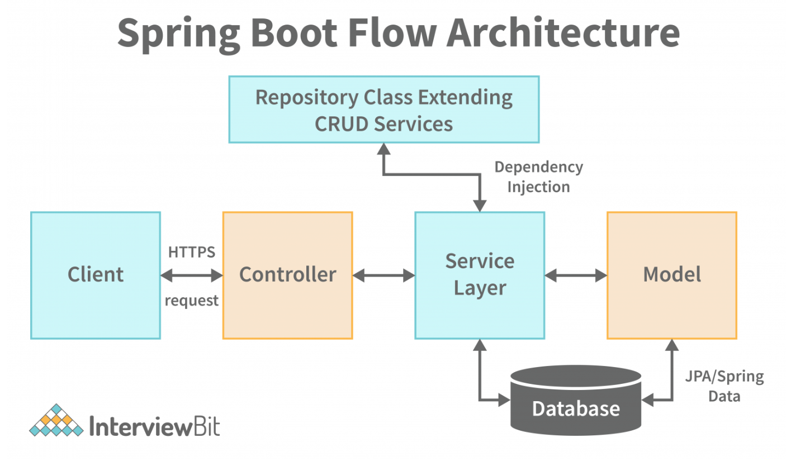

---
## 🎯 Overview

This web application facilitates the module credit recognition process at Leipzig University. It provides a streamlined workflow for students to submit credit recognition applications and for university staff to review and approve them through a multi-stage approval process.



### Key Features

- **Multi-role System**: Student, Student Affairs Office, and Examining Committee interfaces
- **Application Workflow**: Complete lifecycle from submission to approval
- **PDF Processing**: Automated document handling, storage, and summary generation
- **Multi-language Support**: Full internationalization with 10 languages
- **Secure Authentication**: JWT-based authentication with role-based access control
- **Real-time Status Updates**: Live application status tracking
- **Responsive Design**: Mobile-friendly interface built with Vuetify
- **Audit Trail**: Complete application history and change tracking

## 📊 Business Workflow

### Application Lifecycle

1. **Student Submission**: Students submit module credit recognition applications with supporting documents
2. **Office Review**: Student Affairs Office reviews applications for completeness and formal requirements
3. **Committee Approval**: Examining Committee evaluates academic merit and makes final decisions
4. **Status Updates**: Real-time notifications and status updates throughout the process
5. **PDF Generation**: Automated generation of approval/rejection summaries

### User Roles & Permissions

- **Students**: Submit applications, view status, download summaries
- **Student Affairs Office**: Review applications, formal approval/rejection, prepare for committee
- **Examining Committee**: Final academic approval/rejection, course equivalency decisions

### Application States

- `open` - Initial submission
- `edited` - Modified by office
- `formally rejected` - Rejected due to formal issues
- `ready for approval` - Prepared for committee review
- `edited approval` - Modified by committee
- `approved` - Final approval
- `rejected` - Final rejection

## 🏗️ Architecture

The application follows a microservices architecture with clear separation of concerns:



### System Components

#### Frontend (Vue.js)

- **Views**: Role-specific interfaces for different user types
- **Components**: Reusable UI components for forms, tables, and navigation
- **Services**: API communication layer with axios
- **Store**: Centralized state management with Vuex
- **Routing**: Client-side routing with Vue Router
- **Internationalization**: Multi-language support with Vue I18n

#### Backend (Spring Boot)

- **Controllers**: REST API endpoints for client communication
- **Services**: Business logic and core functionality
- **Repositories**: Data access layer with JPA/Hibernate
- **Security**: JWT authentication and role-based authorization
- **Data Transfer Objects**: Structured data exchange between layers
- **Exception Handling**: Centralized error management

#### Database (PostgreSQL)

- **Normalized Schema**: Optimized for data integrity and performance
- **Entity Relationships**: Complex relationships between applications, modules, and users
- **Audit Logging**: Change tracking and history maintenance

## 🛠️ Technology Stack

### Frontend Stack

```json
{
  "framework": "Vue.js 3.2.13",
  "ui": "Vuetify 3.4.0",
  "state": "Vuex 4.1.0",
  "routing": "Vue Router 4.2.5",
  "http": "Axios 1.6.2",
  "i18n": "Vue I18n 9.7.0",
  "testing": "Vitest 0.34.6",
  "linting": "ESLint 8.0.0"
}
```

### Backend Stack

```xml
<dependencies>
  <spring-boot>3.2.0</spring-boot>
  <java>17</java>
  <spring-security>JWT-based</spring-security>
  <spring-data-jpa>3.2.0</spring-data-jpa>
  <postgresql>runtime</postgresql>
  <h2>test-scope</h2>
  <lombok>optional</lombok>
  <modelmapper>3.1.1</modelmapper>
  <pdfbox>2.0.29</pdfbox>
</dependencies>
```

### Infrastructure

- **Containerization**: Docker & Docker Compose
- **Reverse Proxy**: Nginx
- **CI/CD**: GitLab CI/CD with automated testing and deployment
- **Monitoring**: Application-level logging with SLF4J

## Tags
