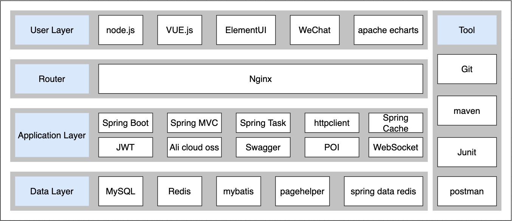

---

## Project Overview

**Yummy-spicy** is a comprehensive full-stack restaurant management system built with modern web technologies. The project demonstrates enterprise-level software architecture, implementing both administrative management tools and customer-facing applications for a complete restaurant operations solution.

---

## Tech Stack

---

## Backend (Spring Boot)
- **Framework**: Spring Boot 2.x with Maven multi-module architecture
- **Database**: MySQL with MyBatis ORM for data persistence
- **Authentication**: Dual JWT system (admin employees + WeChat users)
- **API Design**: RESTful APIs with comprehensive Swagger documentation
- **Security**: JWT interceptors, password encryption, input validation
- **Caching**: Redis for restaurant status and session management

---

## Frontend & Integration
- **Admin Panel**: Web-based dashboard for restaurant management
- **Customer Interface**: WeChat Mini Program for mobile ordering
- **Reverse Proxy**: Nginx for load balancing and static file serving
- **File Upload**: Local storage with OSS integration support

---

### Admin Management System
- **Employee Management**: Complete CRUD operations with role-based access
- **Menu Management**: Dynamic dish and setmeal (combo) configuration
- **Category Management**: Hierarchical food category organization
- **Order Processing**: Real-time order tracking and status management
- **File Upload**: Image management for dishes and promotional content

---

### Customer Experience
- **WeChat Integration**: Seamless login via WeChat Mini Program
- **Menu Browsing**: Real-time menu with availability status
- **Shopping Cart**: Persistent cart management across sessions
- **Order Management**: Order placement and tracking functionality

---

## Technical Highlights

### Advanced Spring Boot Features
- **AOP Integration**: Automatic field population for audit trails
- **Custom Interceptors**: JWT validation and request context management
- **Global Exception Handling**: Centralized error management
- **Dynamic SQL**: MyBatis XML for flexible database queries
- **Pagination**: Efficient PageHelper implementation for large datasets

### Database Design
- **11-table Schema**: Normalized design supporting complex business relationships
- **Dual Authentication**: Separate user systems for employees and customers
- **Audit Trails**: Comprehensive tracking of create/update operations
- **Flexible Menu System**: Support for individual dishes and combination meals

### Security & Performance
- **Stateless Authentication**: JWT tokens with configurable expiration
- **Password Security**: MD5 encryption with secure defaults
- **Thread Safety**: ThreadLocal for request context isolation
- **SQL Injection Prevention**: Parameterized queries throughout
- **Efficient Pagination**: Optimized database queries for large datasets

---

## Project Impact & Learning Outcomes

This project showcases expertise in:
- **Full-Stack Development**: End-to-end application development
- **Enterprise Architecture**: Scalable, maintainable code structure  
- **Database Design**: Complex relational database modeling
- **API Development**: RESTful service design and documentation
- **Security Implementation**: Authentication, authorization, and data protection
- **Third-Party Integration**: WeChat API integration for mobile payments
- **DevOps Practices**: Nginx configuration and deployment strategies

---

## Business Value

The system addresses real restaurant operational needs including staff management, inventory control, customer engagement, and order processing. The WeChat integration targets the Chinese market where WeChat Mini Programs are widely adopted for business applications.

---

## Tags
